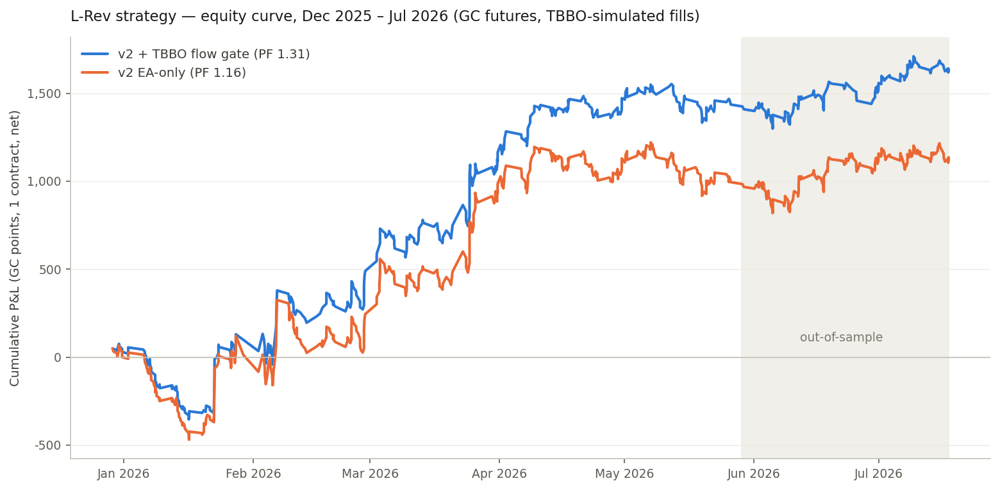

# LCB-System × TBBO Research Report

**Instrument:** GC (COMEX Gold futures, front month via GC.v.0) · **Data:** Databento GLBX.MDP3 — TBBO (every trade + best bid/offer, 14.6M records, 2025-12-28 → 2026-07-17), OHLCV-1m and 1d for warmup history · **Date:** 2026-07-22

---

## 1. What was done

The original EA (v1.50) contains two independent modules: the **L-System** (fractal swing levels, 8 bars each side, traded with GTC stop orders placed directly at the level) and the **CB-System** (breakout of an abnormally large candle, body ≥ 3× the 50-bar median). Both run on M15/H1/H4 with SL = median true range × multiplier and TP = SL × RR.

Both modules were re-implemented in Python, faithful to the EA's mechanics (signal-bar indexing, one-order-per-level consumption, order expiries, spread-aware stop triggers), and simulated tick-by-tick against the TBBO stream: buy stops fill when the **ask** crosses the stop, sell stops when the **bid** does, SL exits checked with priority on the same tick, and every fill pays the real quoted spread. Costs of 0.15 pts/round turn (≈ $15/contract: commission + 1 tick slippage) were charged on top. The four contract segments (GCG6→GCJ6→GCM6→GCQ6) were backtested independently, with state reset at each roll.

Research discipline: all rule selection used only **in-sample** data (Dec 28 – May 29, contracts GCG6/GCJ6/GCM6). The last contract, **GCQ6 (May 29 – Jul 17), was held out** and evaluated exactly once with locked configurations.

## 2. Baseline results (the EA as it is)

| Module | Trades | Net P&L (pts) | Win % | Profit factor |
|---|---|---|---|---|
| CB-System (all TFs) | 1,266 | **−3,094** | 32% | 0.79 |
| L-System (all TFs) | 1,150 | **−424** | 36% | 0.97 |

**CB-System is structurally unprofitable on GC.** The TBBO forward-return analysis shows why: after an abnormally large candle (norm body ≥ 3), price on average *mean-reverts* for the next 30 min–8 h (−0.8 to −1.8 pts drift against the breakout direction) before the larger trend resumes at ~24 h. The system buys exactly where short-term adverse selection is worst. The bigger the candle, the worse the trade (top norm-body quartile: −2.68 pts/trade). Inverting the system (fading the breakout) was tested extensively — flow-gated, spread-gated, time-stopped, deeper entries — and never produced a configuration that was positive across all in-sample segments with a stable parameter neighborhood. **Recommendation: keep CB-System disabled.**

**L-System was essentially breakeven** — the right raw material. TBBO analysis located exactly where it bleeds and where it earns.

## 3. What the TBBO data revealed (L-System)

**Stale orders lose.** Levels that fill more than ~35 h after detection average −4.45 pts/trade (−1,283 pts total); fills within 2–35 h average +1 to +2.9. An old swing level whose stop finally gets hit is usually just in the path of a developed trend running it over.

**Wide-spread fills are toxic.** Trades triggered while the quoted spread exceeded $0.90 (news spikes, illiquid hours) averaged −5.92 pts (−1,668 pts total). These are precisely the fills a resting stop order gets during data releases.

**Flow quality at the trigger matters, non-monotonically.** Using the 30-second aggressor imbalance (buy-initiated minus sell-initiated volume over total), aligned with trade direction: breaks with *moderate confirming* flow (0 to +0.6) perform best; breaks against the flow (< 0) are stop-runs that revert; breaks with *climactic* flow (> 0.6) are exhaustion — late entries into a move already done. This is a pure TBBO signal — invisible to MT5, which has no aggressor data.

Session and trend-side effects were also found (18:00–24:00 UTC entries strongest; buy-side breaks after H4 downtrends strongest) but were deliberately **not** included in the final rules: they concentrate the system into fewer trades and carry a higher risk of period-specific fitting. They are documented in the trade logs for your own inspection.

## 4. The v2 strategy ("L-Rev")

L-System mechanics unchanged (levels, MTR-based SL, RR 2.0, original per-TF multipliers 1.5/0.5/0.5 — the exit grid confirmed the defaults sit in the robust optimum), plus three gates:

1. **Order age cap** — cancel any unfilled pending order 35 h after first placement and consume the level.
2. **Spread gate** — while spread > $0.90, pull the module's pending orders; re-place when the spread normalizes.
3. **Flow gate (optional, needs live TBBO feed)** — take the level break only when the direction-aligned 30 s aggressor imbalance is in [0.0, 0.6]. Requires running entries as synthetic stops.

### Results (net of spread + 0.15 pts costs, 1 contract, GC $100/pt)

| Config | Period | Trades | P&L (pts) | Avg | Win % | PF | Max DD |
|---|---|---|---|---|---|---|---|
| v2 EA-only (gates 1+2) | full 6.5 mo | 694 | **+1,122** | +1.62 | 37% | 1.16 | 535 |
| v2 + flow gate | full 6.5 mo | 546 | **+1,625** | +2.98 | 40% | 1.31 | 430 |
| v2 EA-only | **OOS only** | 199 | +127 | +0.64 | 37% | 1.08 | 180 |
| v2 + flow gate | **OOS only** | 150 | **+189** | +1.26 | 40% | 1.16 | 148 |

Both configurations were positive in the held-out period, in every in-sample segment, in 7 of 8 calendar months (flow-gated), and survive a doubled cost assumption (0.30 pts/RT: OOS +166 pts flow-gated, +98 EA-only). Neighboring parameter values (flow band 0.5 vs 0.6, RR 1–3, age cap ±) are all positive — the result is a plateau, not a spike. Monthly P&L, per-TF and per-direction breakdowns are in the trade-log CSVs.

## 5. Deliverables

- **`L-Rev-System_TBBO_v2.mq5`** — the updated EA. Ships with CB off, age cap 35 h, spread cap $0.90, flow gate off by default. Also fixes two v1.50 compile errors (`Shared_RR=rr;` assignments to an input in both Init functions).
- **`tbbo_flow_bridge.py`** — reference bridge: Databento live TBBO → 30 s imbalance file → EA flow gate (`L_UseFlowGate=true`). Requires a Databento live subscription.
- **`backtest/`** — the full Python engine (`engine.py`, `variants.py`, `research.py`, `prep.py`) so every number here can be reproduced from your DBN files.
- **`trades_v2_flowgate.csv`, `trades_v2_ea_only.csv`** — every simulated trade with timestamps, prices, exits and the TBBO features at trigger.

## 6. Honest caveats

This is 6.5 months of data in a strongly trending gold market — a regime, not a lifetime; the edge should be re-validated as more TBBO history accrues, and the January drawdown (~−400 pts peak-to-trough) is what the strategy feels like when it's cold. The simulation assumes CME futures fills; if you run the EA on a CFD feed, spreads and session times differ and the spread-gate threshold should be re-measured on that feed. Trade sizing here is a constant 1 contract with no overlap limit — the EA can hold several positions at once, so size conservatively. Out-of-sample profit factors (1.08–1.16) are realistic magnitudes for a mechanical system, not get-rich numbers: the flow-gated OOS average of +1.26 pts/trade is about 12 ticks of edge. None of this is financial advice — it's a research result on the data you provided.
